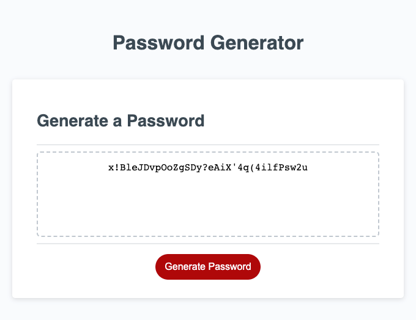

# challenge5-Password-Generator

## Description 
> Challenge 5 is about creating an app that will generate a random password based on selected criteria by a user. When clicked on the button the app presents a series of prompts to chose length and what characters to use. 

## Usage 
To access the solution open the below link to deployed application.
* Deployed application - [https://marzena-w.github.io/password-generator/]
* Click button "Generate Password"
* Answer prompts
* Screenshot of the challenge5:

## Credits

* How to remove commas from the array while displaying - [https://developer.mozilla.org/en-US/docs/Web/JavaScript/Reference/Global_Objects/Array/join]
* To refresh info about prompts - [https://www.youtube.com/watch?v=kUDMxeTRk98]
* To see website updates - Live Server - [https://marketplace.visualstudio.com/items?itemName=ritwickdey.LiveServer]

## License
MIT
